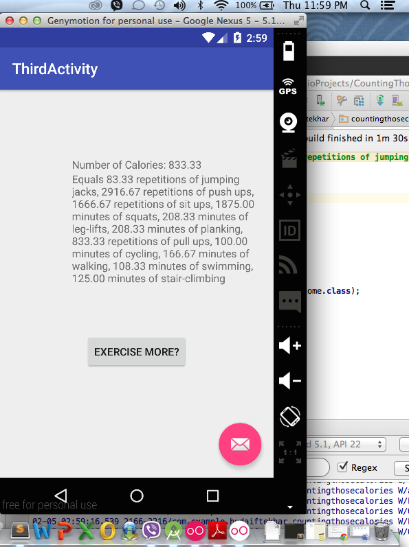
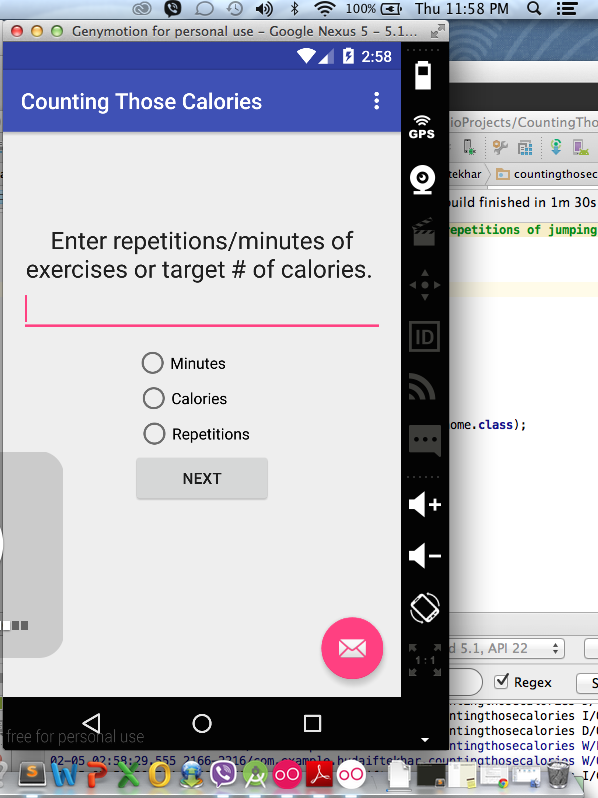
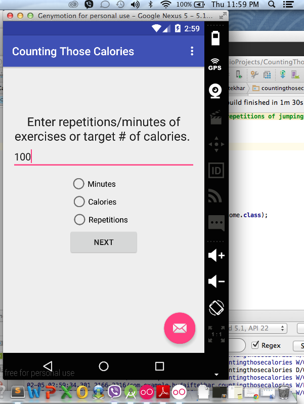
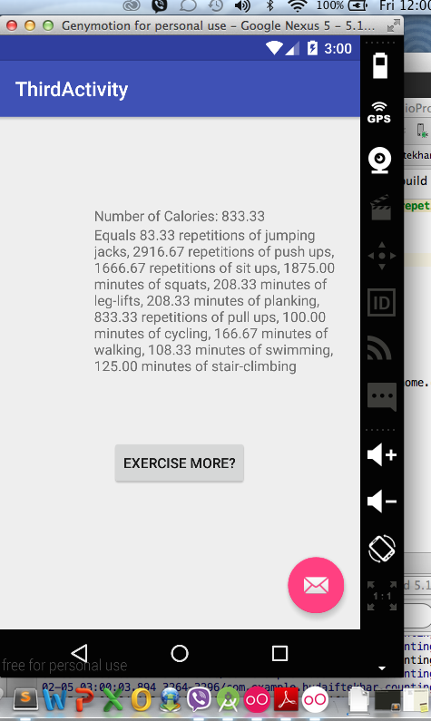
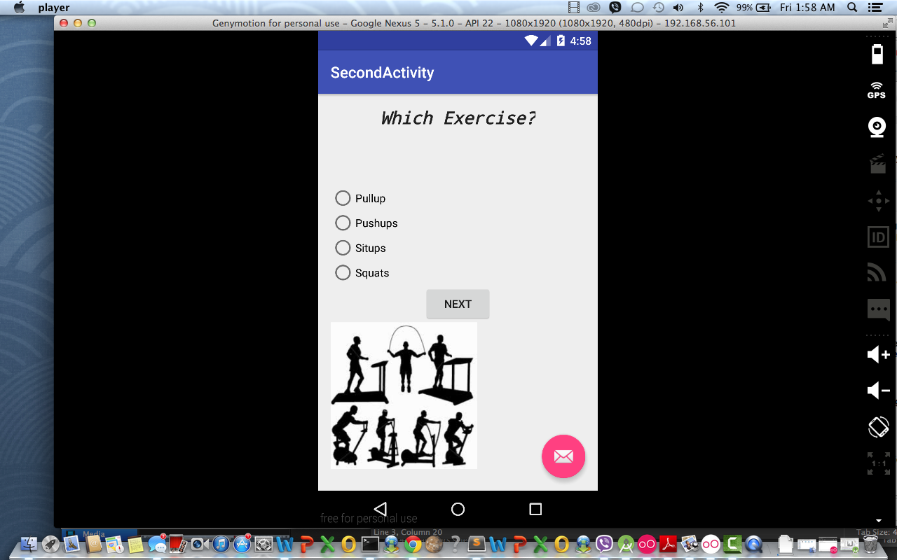
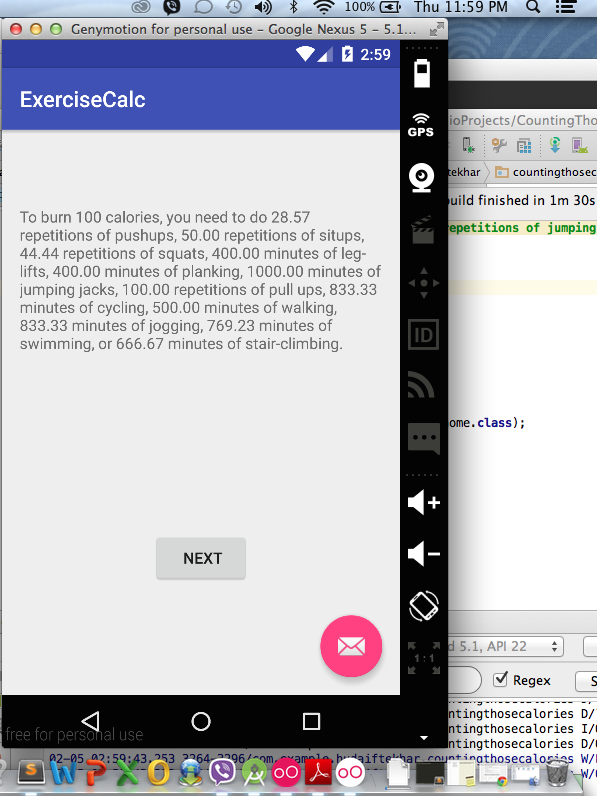
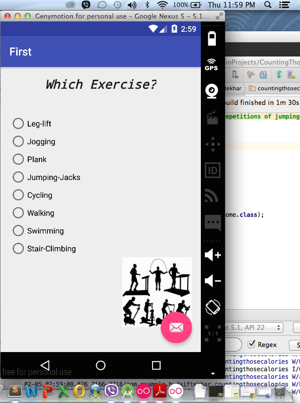

# PROG 01: Crunch Time

The purpose of my app is to help users keep track of calories used. Users can enter in the number of repetitions/minutes they did of an exercise, and the app will tell you how many calories you used up and equivalent workout sizes. Users can also enter their goal amount of calories, and it will provide all the different exercises you can do. 

## Authors

Huda Iftekhar ([hiftekhar@berkeley.edu](mailto:hiftekhar@berkeley.edu))

## Demo Video

See https://www.youtube.com/watch?v=2p0aXiBioA4

## Screenshots

## Acknowledgments

* the image of exercising used on my app.
http://www.riskmanagement365.com/wp-content/uploads/2013/03/physical-exercise.jpg

